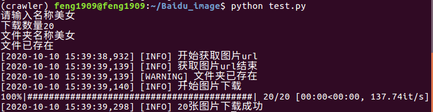

# 百度图片爬虫

**用于爬取一定类型的图片进行深度学习训练**

## Start

```bash
pip install -r requirement -i https://pypi.douban.com/simple
```

## Use

```bash
python function.py
```

## 效果




## 使用文档

### get_images_rul

```python
class Crawler:

    @staticmethod
    def get_images_url(word: str, num: int, original: bool = True,
                       timeout: int = __CONCURRENT_TIMEOUT) -> (bool, bool, list):
```

**参数**

* `word:str`:搜索关键词
* `num:int`:搜索数量
* `original:bool, optional`:是否下载原图，默认为`False`
* `timeout:int, optional`:请求timeout，默认为60s

**返回**

* `net:bool`:网络连接状态
* `num:bool`:图片数量是否足够
* `urls:list`:获取的urls，每项为一个dict，

### download_images

```python
class Crawler:

    @staticmethod
    def download_images(urls: list, rule: tuple = ('.png', '.jpg'),
                        path: str = 'download', timeout: int = __CONCURRENT_TIMEOUT,
                        concurrent: int = __CONCURRENT_NUM, command: bool = True) -> (int, int):
```

**参数**

- `urls: list`: 需要爬的图片列表，格式与`get_images_url`返回的相同
- `rule: tuple, optional`: 允许下载的格式，默认为`('.png', '.jpg')`
- `path: str, optional`: 图片下载的路径，默认为`'download'`
- `timeout: int, optional`: 请求 timeout, 默认为`60(s)`
- `concurrent: int, optional`: 并行下载的数量，默认为`100`
- `command: bool, optional`: 是否在控制台显示进度条，默认为`True`

**返回**

- `success: int`: 下载成功的数量
- `failed: int`: 下载失败的数量